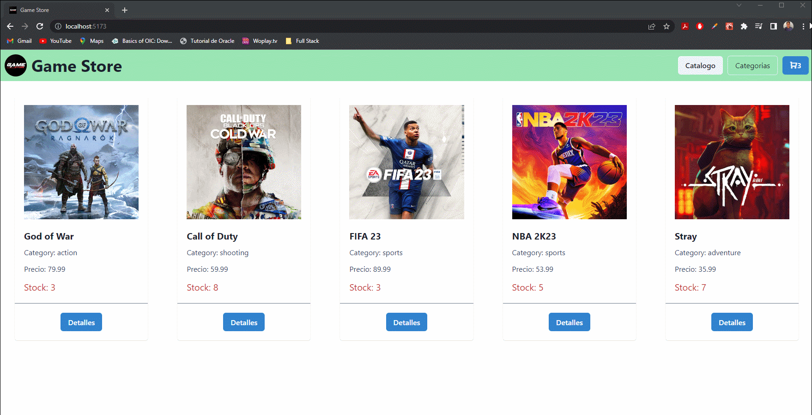

# E-commerce: Game Store

Bievenidos al repositorio correspondiente al proyecto final del curso de React en Coderhouse. El mismo consiste en un **E-commerce de venta de videojuegos**.

El mismo fue realizado utilizando el framework React y una libreria de estilos como lo es Chackra UI.


Dentro de los aspectos de React, se utilizaron conceptos tales como: 
1. Routing. 
2. Hooks.
3. Componentes.
5. Promesas, asincronía y MAP

_Para porder realizar una correcta ejecucion y prueba del mismo, se debe descargar y abrir su contenido en un proyecto nuevo en VSCode. Posterior se debe ejecutar los siguientes comandos:_

```
npm install vite@latest
npm run dev
```

Una prueba de funcionamiento del mismo se puede visualizar en el siguiente GIF:



|Nombres|Apellidos|Email|
|---|---|---|
|Simón Elías|Jalil Cruz|simonjalilcruz@gmail.com|